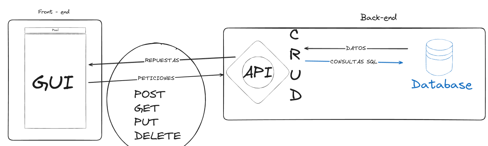
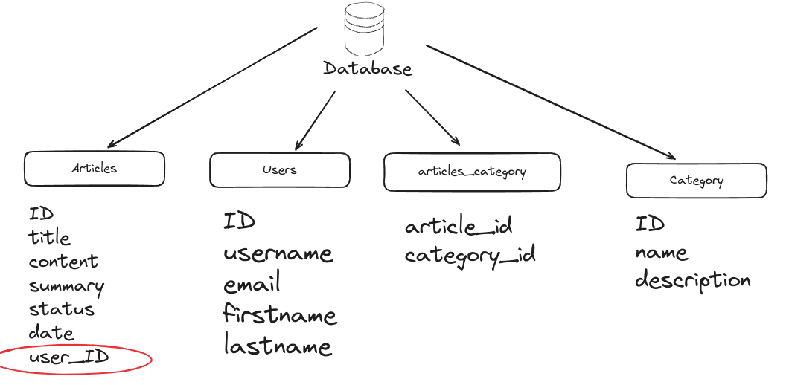

# Personal Blogging Platform API

> Image of project

This is a `RESTful API` that would power a personal blog.

**Functions:**
- Return list of articles.
- Return single article.
- Create new article.
- Delete single article, by the `ID`.
- Update single article, using specify `ID`.

**Tecnologie:**
- MySql
- Python for version 1 (FastAPI)
- Python for version 2 (Flask) -- **review** 
- Golang for version 1.1(learn golang with projects)
- Postman

**Design database**
Construction model of database:

**JSON**

- Return element in json.dumps(<data>)
- Next is tranform in json with json.loads(<data>)

**SQLAlchemy**
- Install --> pip install sqlalchemy
- Common ORMs are for example: Django-ORM (part of the Django framework), `SQLAlchemy ORM (part of SQLAlchemy, independent of framework)` and Peewee (independent of framework), among others.

**Depends**

spanish concept [Una dependencia en software es cualquier objeto que una clase necesita para funcionar correctamente. Por ejemplo, si una clase A necesita una instancia de la clase B para realizar alguna de sus funciones, B es una dependencia de A.]

**FastAPI - Notes and Concepts**

*Simple types*

You can use, for example:
- str
- int
- float
- bool
- bytes
- list[str] --> example type list || example: func(hhh:list[str])
- Optional[str] = None --> from typing import Optional || example: func(name: Optional[str]= None)
- str | None --> Union || exmaple: func(name: str | None)

*Pydantic Models*

Library to perform data validation 

from pydantic import BaseModel

class User(BaseModel):
    id: int
    name: str = "John Doe"
    signup_ts: datetime | None = None
    friends: list[int] = []

*Concurrency and async / await*

Details about the async def syntax for path operation functions and some background about asynchronous code, concurrency, and parallelism.

# Tutorial 

- Install -> pip install api 
- Run of code --> fastapi dev main.py

**Operations**

- POST: to create data
- GET : to read data
- PUT : to update data
- DELETE : to delete data

-...the query parameters are:
`http://127.0.0.1:8000/items/?skip=0&limit=10`
skip: with a value of 0
limit: with a value of 10